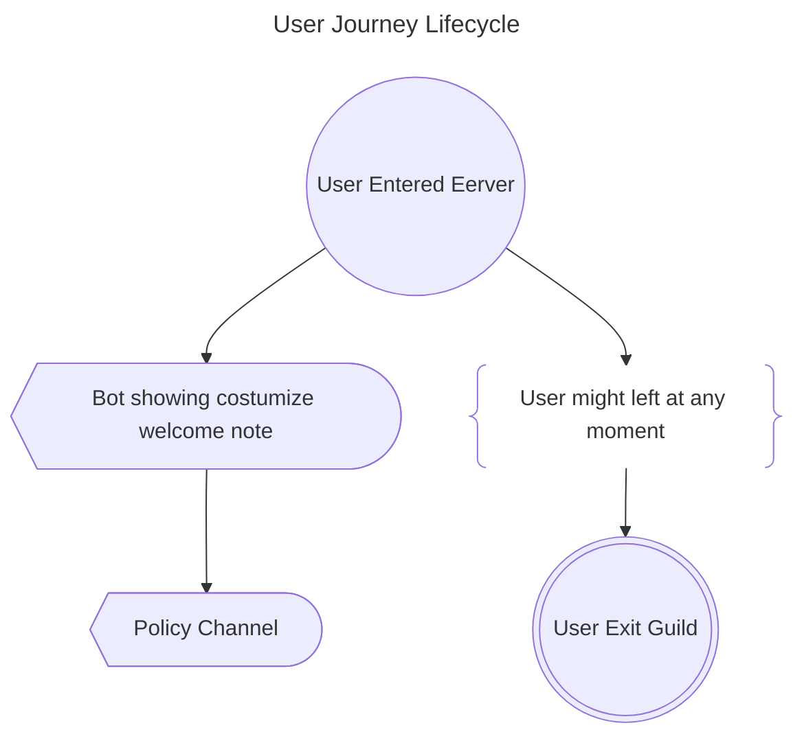

# Architecture

# User Journey Flow

```mermaid
---
title: User Journey Lifecycle
---
flowchart TD
%% Global Part %%
JourneyStart@{ shape: circle, label: "User Entered Eerver"}
UserExitGuild@{ shape: dbl-circ, label: "User Exit Guild"}
JourneyStart
-->WelcomePromptNote@{ shape: curv-trap, label: "Bot showing costumize welcome note"} 
-->ShowPolicyChannel@{ shape: curv-trap, label: "Policy Channel"}
JourneyStart
-->UserLeftComment@{ shape: braces, label: "User might left at any moment"}-->UserExitGuild
```